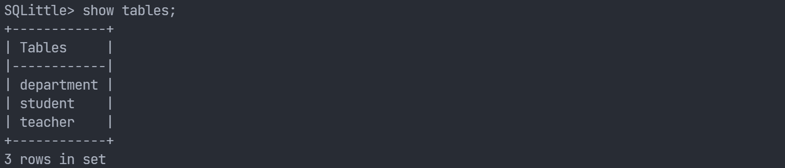
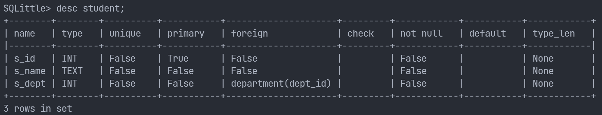
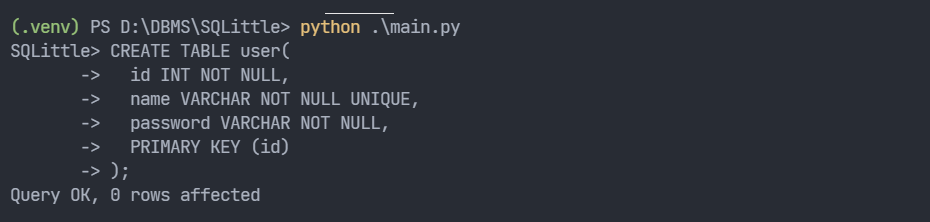
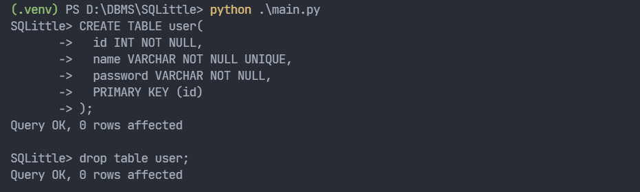
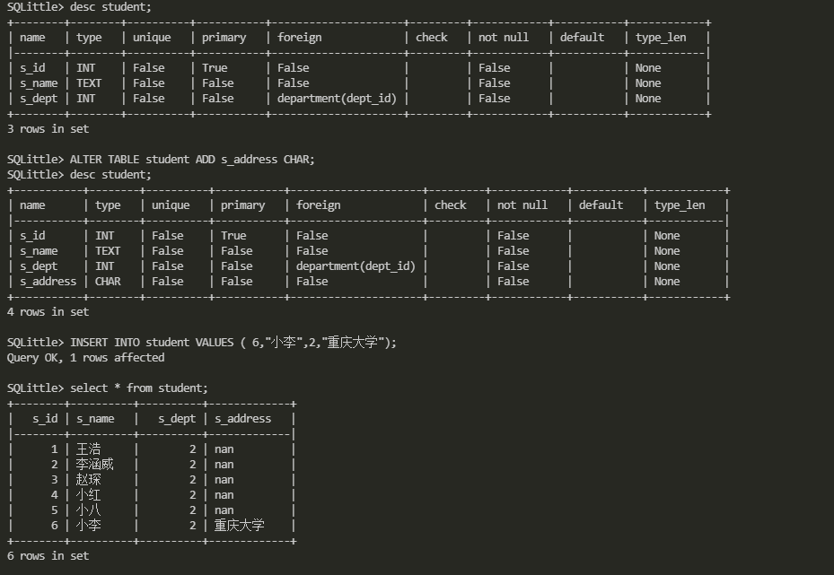
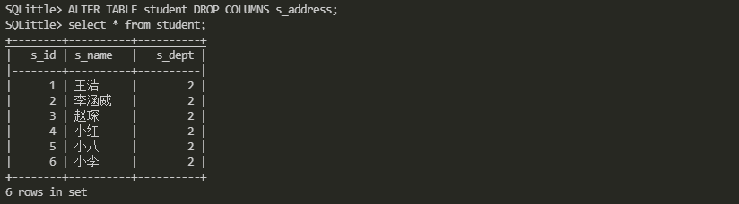
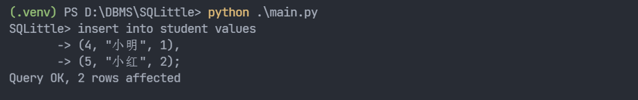
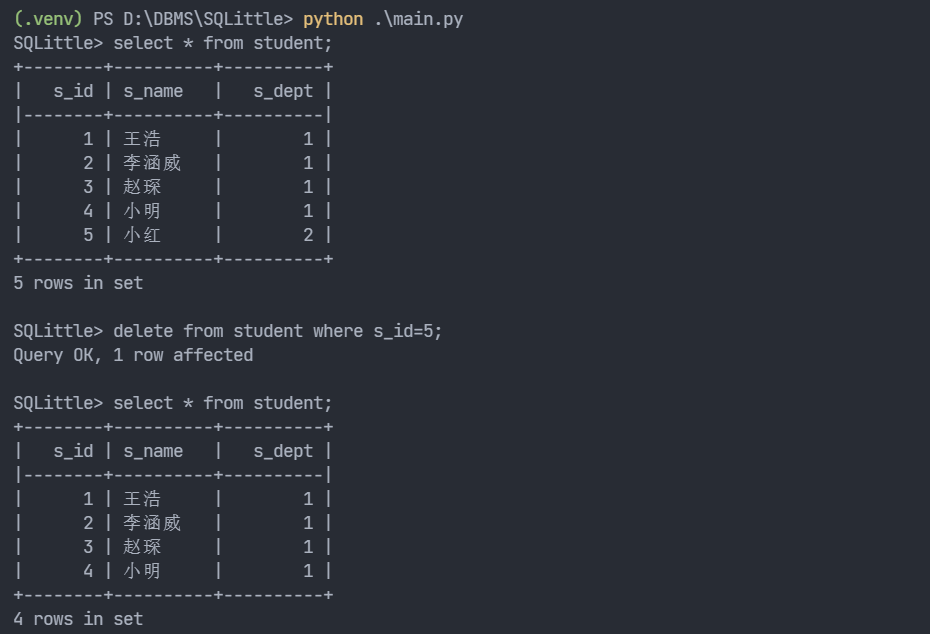
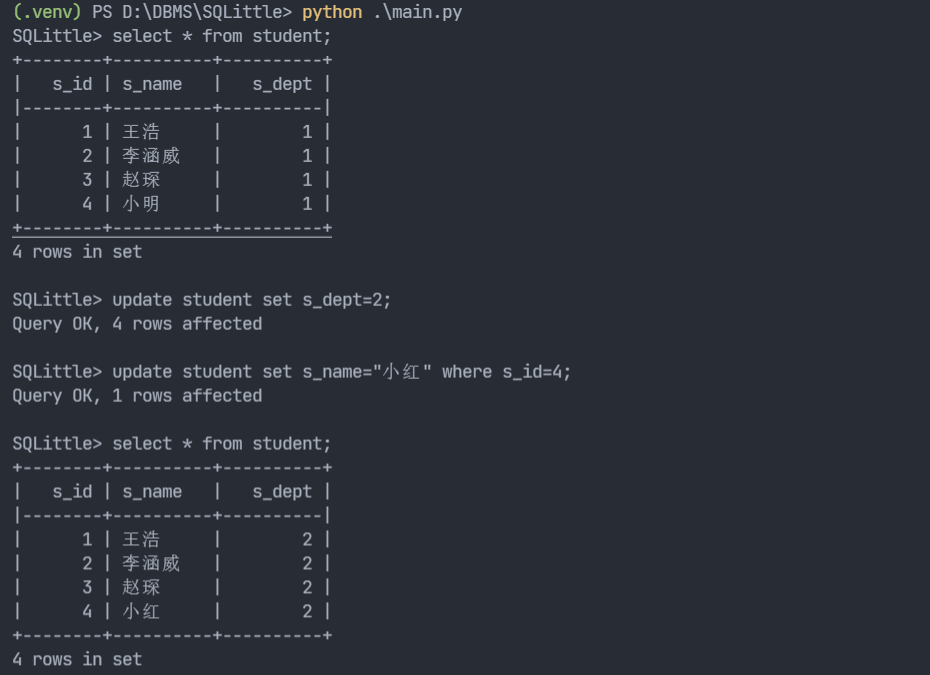
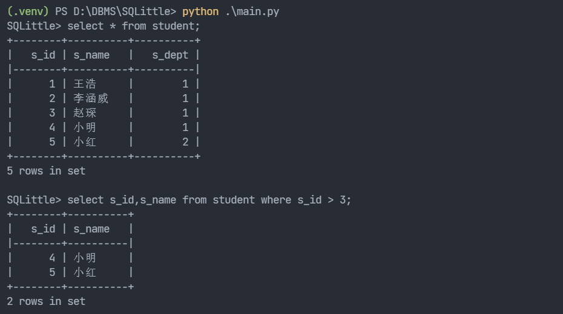

# 数据库原理课程Project

## 简介
该project实现一个元数据管理器，并基于该元数据管理器进行关系的存储与基本操作。我们基于[cyyself](https://github.com/cyyself)实现的基于json文件的元数据存储方案，进一步添加基本操作的SQL解析和命令行交互功能。

## 环境配置
```bash
# clone this repository
git clone https://github.com/iamwhcn/SQLittle.git
cd SQLittle
# create a python 3 virtual environment
python -m venv .venv
pip install -r requirements.txt
# run
python main.py
```

## 实现的命令
### 查看所有表
```
show tables;
```


### 查看数据类型
```
show types;
show [numerical, string, time] types;
```


### 查看表信息
```
describe [table name];
```


### 创建表
支持如下约束
- PRIMARY KEY
- UNIQUE
- NOT NULL
- FOREIGN KEY

其中主码约束和外键约束必须写在后面，且外码约束不能指定名字或者级联删除等

foreign key (CharID) references ChineseCharInfo(ID)
```
CREATE TABLE user(
  id INT NOT NULL,
  name VARCHAR NOT NULL UNIQUE,
  password VARCHAR NOT NULL,
  PRIMARY KEY (id)
);
```


### 删除表
```
drop table [table name];
```


### 修改表
添加字段
```
ALTER TABLE [table name] ADD [field name] [field type];
```


删除字段
```
ALTER TABLE [table name] DROP COLUMNS [field name];
```


### 插入数据
不支持指定字段和顺序，必须和创建表时的字段和顺序保持一致

```
INSERT INTO [table name] VALUES
( value1, value2,...valueN ),
( value1, value2,...valueN );
```


### 删除数据
只支持单表、单条件删除，condition只支持>,<,=
```
DELETE FROM [table name] WHERE condition;
```


### 更新数据
只支持单表、单条件更新，condition只支持>,<,=
```
UPDATE [table name] 
SET field1=value1, field2=value2 
[WHERE condition];
```


### 查询数据
只支持单表、单条件查询，condition只支持>,<,=
```
SELECT column_name,column_name
FROM [table name]
[WHERE condition]
```
